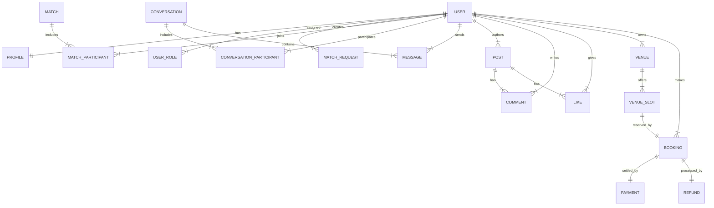

# Database Documentation

This document describes the database schema for the Matchill backend, including collection purposes and entity relationships.

## 1. Core Module
Manages authentication, user profiles, and authorization.

- **users**: Stores authentication credentials and account status.
- **profiles**: Contains personal information and preferences for each user.
- **user_roles**: Defines access levels (user, admin, owner).

### Relationships
- Each **user** has one **profile**.
- Each **user** has one or more **roles**.

## 2. Matching & Discover Module
Facilitates finding sport partners and official matches.

- **match_requests**: Records user requests for sport partners with specific criteria (sport, time, location).
- **matches**: Stores data for official matches.
- **match_participants**: Tracks users joining a specific match.
- **discover_posts**: Community posts to find players or teammates.

### Relationships
- A **user** creates multiple **match_requests**.
- A **match** connects multiple **users** via **match_participants** (N-N).

## 3. Communication Module
Handles messaging and chat rooms.

- **conversations**: Represents a chat room (direct or group).
- **conversation_participants**: Maps users to conversations.
- **messages**: Stores text content sent by users.

### Relationships
- **conversations** link multiple **users** via **conversation_participants** (N-N).
- A **conversation** contains many **messages**.

## 4. Social Module
Manages community interaction through a feed.

- **posts**: Original content shared by users.
- **comments**: Feedback on specific posts.
- **likes**: Interaction signal for posts.

### Relationships
- A **user** creates many **posts**, **comments**, and **likes**.
- A **post** aggregates multiple **comments** and **likes**.

## 5. Venue & Booking Module
Manages sport facility availability and reservations.

- **venues**: Details of sport facilities and their owners.
- **venue_slots**: Specific time windows available for booking.
- **bookings**: Reservation records for a venue slot.
- **payments**: Financial transactions linked to bookings.
- **refunds**: Refund processing records.

### Relationships
- A **venue** offers multiple **venue_slots**.
- A **venue_slot** links to one **booking**.
- A **booking** has one **payment** and one **refund** record.

## Entity Relationship Summary

